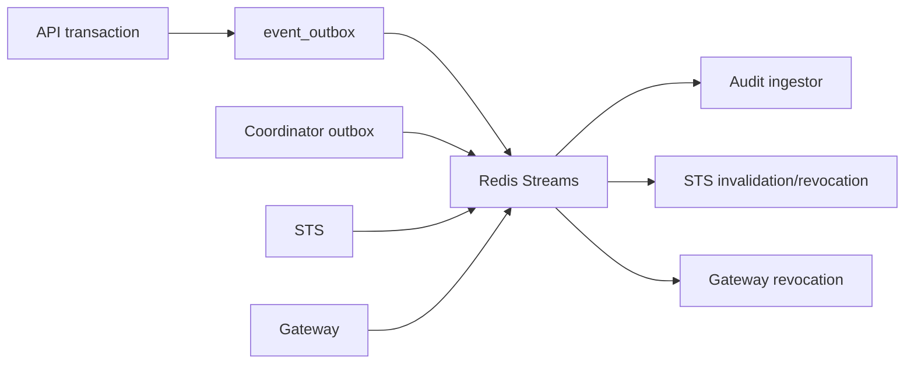

Redis Streams move operational events between Caracal services. Redis is not the durable source of product state; Postgres remains authoritative.

## Streams and Groups

| Stream | Consumer groups |
| --- | --- |
| `caracal.audit.events` | `audit-ingestor`, `siem-export` |
| `caracal.audit.events.dlq` | `audit-dlq-observer` |
| `caracal.policy.invalidate` | `opa-engine` |
| `caracal.sessions.revoke` | `sts-revocation` |
| `caracal.keys.invalidate` | `sts-keys` |
| `caracal.agents.lifecycle` | `coordinator-relay` |
| `caracal.invocations.lifecycle` | `invocations-observer` |
| `caracal.delegations.invalidate` | `delegations-observer` |
| `caracal.providers.ratelimit` | initialized as a one-entry stream |

## Provision

```bash
REDIS_HOST=localhost REDIS_PORT=6379 \
REDIS_PASSWORD_FILE="${CARACAL_SECRETS_DIR:-${CARACAL_HOME:-$HOME/.local/share/caracal}/secrets}/redisPassword" \
bash infra/redis/provision-streams.sh
```

The provisioner is idempotent, creates consumer groups with `MKSTREAM`, and warns when an existing stream length exceeds the intended bound.

## Verify

```bash
REDIS_HOST=localhost REDIS_PORT=6379 \
REDIS_PASSWORD_FILE="${CARACAL_SECRETS_DIR:-${CARACAL_HOME:-$HOME/.local/share/caracal}/secrets}/redisPassword" \
bash infra/redis/scripts/verify.sh
```

Verification checks stream existence, consumer group existence, and provisioner idempotency.

## Event Path



Stream messages are signed with `STREAMS_HMAC_KEY` in published modes.

## Troubleshooting

| Symptom | Check |
| --- | --- |
| Audit DLQ grows | HMAC failures, malformed producers, Redis memory pressure, and Audit database writes. |
| Policy changes do not take effect | `caracal.policy.invalidate` group health and STS policy age metrics. |
| Revocation is delayed | `caracal.sessions.revoke` pending entries and Gateway/STS consumer health. |
| Provisioner warns about length | Plan an explicit stream retention/reset; provisioning does not rewrite stream policy silently. |

## Next Step

Use [Scale Capacity](/operations/scale-capacity/) when storage, streams, or service pools approach operational limits.
