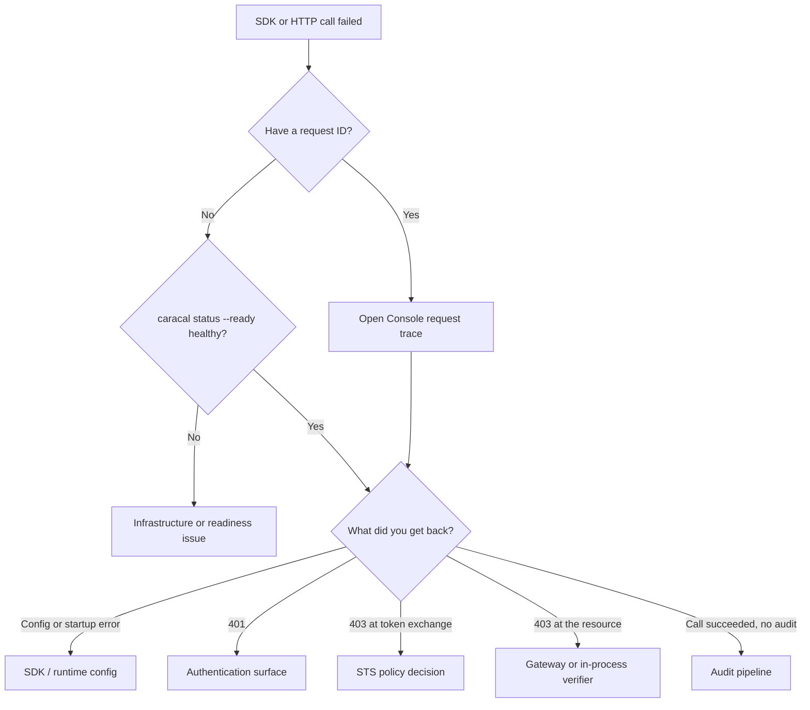

Most Caracal failures are easy to fix once you know **where** they happened. This page starts from the symptom you can see — usually an SDK error or an HTTP status — and routes you to the failing surface, the object to inspect, and the tool that confirms it. It complements [Operator Debugging](/operations/debugging/), which works from infrastructure inward; start here when you have an application-level failure and an error or request ID.

## Locate the surface first

The Console **request trace** is the fastest disambiguator: it ties one request ID to the resource, subject, scopes, determining policies, diagnostics, and result, so you can see whether the denial came from STS policy or from a resource verifier.

:::note[FAQ]
[What is the difference between a 403 from STS and a 403 from Gateway?](/reference/faq/#faq-sts-403-versus-gateway-403)
:::

## Route by symptom

| Symptom | Surface | Inspect | Tool |
| --- | --- | --- | --- |
| SDK throws `config_missing` or cannot start | SDK / runtime config | Runtime profile, secret file, and required environment variables. | `caracal status --json`, profile file |
| `401` from API or Console | Authentication | Admin or Control token, or workload credential source. | [Console](/runtime-console/console/) credential inputs |
| `403` from a token exchange (`access_denied`) | STS policy | Active policy-set activation, application ID, subject, requested scopes, and grant. | `request trace`, Console `audit` |
| `403` at the resource (`invalid_token`, `scope_insufficient`) | Gateway or in-process verifier | Mandate validity, issuer/JWKS trust, `X-Caracal-Resource`, binding, and verifier scope checks. | [Gateway Behavior](/api/gateway/), verifier logs |
| `scope_insufficient` even after a policy allow | Resource definition | Whether the resource defines the scope and the policy authorizes it. | Console `resource`, `request trace` |
| Call works but no audit event appears | Audit pipeline | Selected zone, time window, Redis stream health, and Audit readiness. | Console `diagnostics`, `audit` |
| Access continues after revocation | Resource verifier | Whether revocation consumers run on the resource server. | [Sessions and Revocation](/concepts/sessions-revocation/) |

## The denied SDK call, step by step

When an SDK call returns access denied and you are not sure why, walk these in order. Each step either fixes the problem or hands you to the next surface.

1. **Confirm the runtime is healthy.** Run `caracal status --ready`. If a dependency is down, fix that first.
2. **Confirm configuration.** Check the runtime profile, secret file, selected zone, and resource identifier the SDK is using. A wrong resource ID or zone produces denials that look like policy failures.
3. **Trace the request.** Open Console **request trace** with the request ID. It shows the resource, subject, requested scopes, determining policies, and result.
4. **Check the grant and policy.** Confirm a grant binds the application and subject to the resource scopes, and that the active policy set authorizes them. See [Debug Authorization Decisions](/guides/authorize-access/).
5. **Check policy-set activation.** A policy that exists but is not the active set will not take effect. See [Activate a Policy Set](/guides/activate-policy-set/).
6. **Check the requested scopes.** Confirm the SDK requests scopes the resource defines and the policy allows; a typo'd scope denies silently.
7. **Check the Gateway route or verifier.** If STS allowed the exchange but the resource rejected it, inspect the Gateway binding and upstream allowlist, or the in-process verifier's scope and identity checks. See [Gateway Behavior](/api/gateway/).
8. **Confirm the audit trace.** Open Console `audit` for the request ID to read the final decision and diagnostics.

## The diagnostic bundle

Caracal exposes the triage bundle through existing surfaces rather than a separate command. Gather these together when you open an incident or escalate:

| Item | Where |
| --- | --- |
| Config summary and selected zone | `caracal status --json`, runtime profile |
| Service readiness and dependencies | Console `diagnostics` (Doctor: `health`, `readiness`) |
| Visible zones, resources, and policy sets | Console `diagnostics` (Doctor: `zones`) |
| Deployment and operator environment checks | Console `diagnostics` (Doctor: `preflight`) |
| Resource-to-provider binding and policy allow | [Provider Preflight](/examples/) (`examples/providerPreflight`) |
| Last denial and request trace | Console `audit` and `request trace` |

The Console `diagnostics` Doctor view runs `health`, `readiness`, `zones`, and `preflight` in one place, including strict readiness for automation gates. Use it as the single bundle the rest of this page points back to.

:::note[FAQ]
[Where is the diagnostic bundle or doctor command?](/reference/faq/#faq-diagnostic-bundle)
:::

## Related pages

- [Error Reference](/reference/errors/)
- [Operator Debugging](/operations/debugging/)
- [Observability Workflows](/runtime-console/observability/)
- [Debug Authorization Decisions](/guides/authorize-access/)
- [Failure Modes and Recovery](/operations/failure-modes/)
