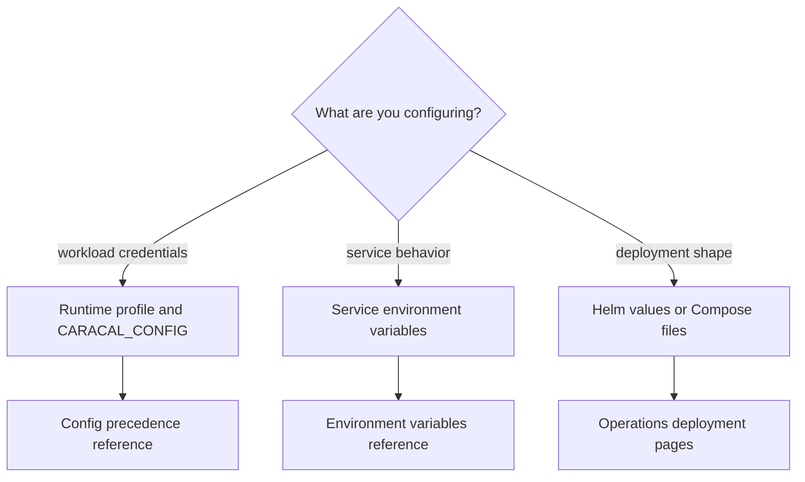

Caracal has three configuration domains:

| Domain | Used by | Choose it when |
| --- | --- | --- |
| Runtime workload config | `caracal run` and SDK clients. | A workload needs Caracal-issued resource credentials. |
| Service environment config | API, STS, Gateway, Audit, Coordinator, and Control. | A service needs URLs, secrets, limits, or readiness settings. |
| Deployment values | Helm, Compose, Postgres, and Redis. | Operators size, schedule, expose, or secure infrastructure. |

## Runtime profile fields

| Field | Meaning |
| --- | --- |
| `zone_url` | Cloud/custom STS URL override for token exchange. |
| `sts_url` | Cloud/custom SDK-readable STS alias/fallback. |
| `coordinator_url` | Cloud/custom SDK/Console Coordinator URL override. |
| `gateway_url` | Cloud/custom Gateway URL override for SDK transports. |
| `zone_id` | Zone identifier. |
| `application_id` | Confidential application ID. |
| `app_client_secret_file` | Cloud/custom secret-file path override. |
| `app_client_secret` | Inline local-development secret. |
| `ttl_seconds` | `caracal run` exchange TTL, capped at 900 seconds. |
| `continue_on_failure` | Required credential failure behavior. |
| `credentials[]` | Required resource credentials. |
| `optional_credentials[]` | Optional resource credentials with `on_failure`. |
| `mcp_governance.mode` | `block` or `log` for likely MCP subprocesses. |

Credential entries use `env`, `resource`, optional `upstream_prefix`, and optional `credential_type`. Use `provider_token` for direct `caracal run` provider-key injection and `caracal_mandate` for mandate-aware workloads.

Local dev and stable runtime launches auto-detect the client secret and
credential manifest from the OS Caracal config directory. Use explicit
secret-file paths and service URLs only for cloud deployments, containers, or
custom infrastructure.

## Core service env keys

| Key | Services |
| --- | --- |
| `CARACAL_MODE` | All services. |
| `DATABASE_URL` / `DATABASE_URL_FILE` | API, STS, Gateway, Audit, Coordinator. |
| `REDIS_URL` / `REDIS_URL_FILE` | API, STS, Gateway, Audit, Coordinator. |
| `STREAMS_HMAC_KEY` / `STREAMS_HMAC_KEY_FILE` | Stream producers and consumers. |
| `AUDIT_HMAC_KEY` / `AUDIT_HMAC_KEY_FILE` | Audit producers and Audit service. |
| `GATEWAY_STS_HMAC_KEY` / `GATEWAY_STS_HMAC_KEY_FILE` | API, STS, Gateway. |
| `ZONE_KEK` / `ZONE_KEK_FILE` | API and STS. |
| `CARACAL_ADMIN_TOKEN` / `CARACAL_ADMIN_TOKEN_FILE` | API and management clients. |
| `CARACAL_COORDINATOR_TOKEN` / `CARACAL_COORDINATOR_TOKEN_FILE` | Coordinator and Console agent/delegation views. |

## Deployment values

Helm values live under `infra/helm/caracal/values.yaml`. Compose environment and secrets are defined by `infra/docker/docker-compose.yml` and `infra/docker/runtime-compose.yml`.

## Related pages

- [Configure Workloads](/runtime-console/config-file/)
- [Environment Variables](/operations/env-vars/)
- [Cloud-Native Deployment Profiles](/operations/cloud-native-profiles/)
