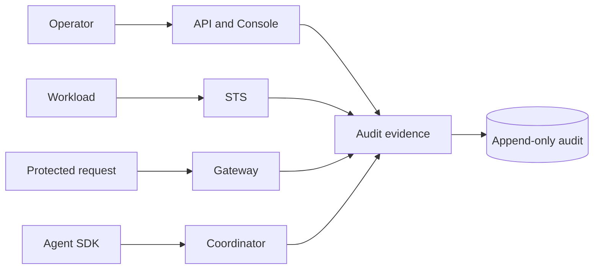

Security in Caracal centers on pre-execution authority: STS issues scoped mandates, Gateway enforces protected-resource access, Coordinator tracks agent/delegation state, Audit preserves evidence, and Operations keeps storage, streams, secrets, and releases recoverable.

## Security model at a glance

## Start here

| Need | Page |
| --- | --- |
| Understand the security boundaries | [Threat Model](/security/threat-model/) |
| Harden a deployment | [Hardening Checklist](/security/hardening/) |
| Report a vulnerability | [Disclosure Policy](/security/disclosure/) |
| Operate a security incident | [Respond to Incidents](/operations/incident-response/) |
| Compare editions and licensing | [Enterprise Edition](/enterprise/) |

## Core invariants

- STS must fail closed on policy, key, session, revocation, replay, step-up, and signing errors.
- Gateway must never trust caller-supplied destinations and must deny before upstream dispatch when authority or routing is unsafe.
- Redis stream messages require HMAC signing in published modes where configured.
- Audit evidence must remain append-only, tamper-evident, and recoverable through replay/DLQ paths.
- Secrets must come from secret files or platform secret managers in production.
- The open-source product must not depend on enterprise-only code or controls.

## Related sections

- [Trust Boundaries](/architecture/trust-boundaries/)
- [Harden Production](/operations/tls-hardening/)
- [Rotate Keys and Secrets](/operations/key-management/)
- [Configure Alerts](/operations/alerts/)
