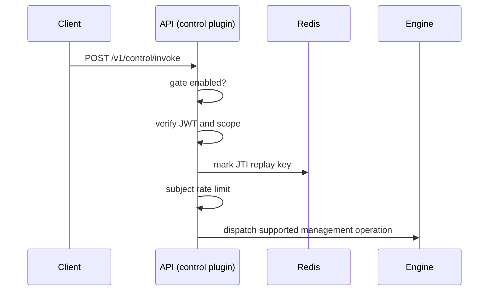

Control is an optional automation surface for remote management operations. It runs as an in-process plugin inside the API service and dispatches through the shared engine after gate, authentication, replay, rate-limit, and scope checks.

## Runtime

Control has no separate deployable or port. The plugin is mounted inside API when
`CARACAL_CONTROL_ENABLED=true` and serves on the API port. A runtime gate file
(`CONTROL_GATE_FILE`) is the instant on/off switch: when the file is absent the
endpoint returns `503` without a restart.

| Property | Value |
| --- | --- |
| Host | API service (port `3000`) |
| Health | `GET /health` |
| Readiness | `GET /ready` |
| Invoke | `POST /v1/control/invoke` |
| Enablement | `CARACAL_CONTROL_ENABLED=true` |
| Runtime gate | `CONTROL_GATE_FILE` present |
| Helm default | disabled (`control.enabled=false`) |

## Invoke Flow



## Required Config

| Variable | Purpose |
| --- | --- |
| `CARACAL_CONTROL_ENABLED` | Mounts the control plugin inside API. |
| `STS_JWKS_URL` | JWT verification keys. |
| `STS_ISSUER_URL` | Expected issuer. |
| `CONTROL_AUDIENCE` | Expected token audience. |
| `CONTROL_API_TOKEN` | API token used for downstream dispatch. |
| `CONTROL_GATE_FILE` | Runtime gate file that must exist before invoke is available. |

## Non-Interactive Automation

Control is the automation counterpart to Console. A CI job, provisioning script,
or onboarding tool drives the same management operations a human performs in
Console, because both run through the shared engine dispatch. Automation never
receives the root admin token; it uses a scoped control key.

1. Create a control key once in Console from the Control menu. Console returns a
   one-time `client_id` and `client_secret` and records the `control:<command>:<verb>`
   scopes the key may request, along with an optional maximum token TTL. The key
   is bound to the zone where it was created.
2. Exchange the key for a short-lived token at the STS token endpoint.

   ```bash
   curl -s -X POST "$STS_URL/oauth/2/token" \
     -d grant_type=client_credentials \
     -d application_id="$CONTROL_CLIENT_ID" \
     -d client_secret="$CONTROL_CLIENT_SECRET" \
     -d resource=caracal-control \
     -d scope="control:resource:write control:policy:write"
   ```

3. Invoke a management command with the returned token.

   ```bash
   curl -s -X POST "$CARACAL_API_URL/v1/control/invoke" \
     -H "authorization: Bearer $TOKEN" \
     -H "content-type: application/json" \
     -d '{"command":"resource","subcommand":"create","flags":{"name":"PiperNet","identifier":"resource://pipernet","scopes":["pipernet.read"]}}'
   ```

STS resolves the bound zone from the authenticated control key; standard
bootstrap workflows must not ask users to provide a separate zone id. Supplying
`zone_id` on a Control key token exchange remains accepted for compatibility but
is deprecated. Each token is short-lived, replay-protected, rate-limited, and audited, so
least-privilege automation stays the easy path. The `controlBootstrap` example
ships a reusable client plus an apply/verify/teardown pipeline that keeps an
agent's environment in sync with a declared plan through this flow.

## Declarative Management

`resource create` and the other per-object verbs are imperative: the caller must
know whether an object already exists and choose create or patch. For real
automation, declare the desired state once and let the server converge to it. The
reconciliation logic lives in the engine, so every adopter — any language, any
device — gets identical behavior without reimplementing a client-side diff.

Three operations cover the full lifecycle, all keyed on each object's stable
identity (application `name`, provider and resource `identifier`, policy and
policy-set `name`):

| Command | Subcommand | Effect |
| --- | --- | --- |
| `ensure` | `application`, `identity-provider`, `resource`, `policy`, `policy-set` | Create-or-patch a single object from its `--spec`. Safe to repeat. |
| `state` | `apply` | Reconcile a whole zone toward a desired-state `--document`: create missing objects, patch drifted ones, publish a new policy version on content change, and optionally `--prune` objects not in the document. |
| `state` | `plan` / `verify` | Read-only. Return the same reconciliation report without writing. `verify` is the CI gate: the report's `drift` field is `true` when the live zone does not match the document. |

A desired-state document is a flat object set. Pass it as the JSON-encoded
`document` flag:

```json
{
  "objects": [
    { "kind": "identity-provider", "spec": { "identifier": "provider://pipernet-mandate", "name": "PiperNet Mandate", "kind": "oidc", "config": { "issuer": "https://login.hooli.example" } } },
    { "kind": "resource", "spec": { "identifier": "resource://pipernet", "name": "PiperNet", "scopes": ["pipernet.read"] } },
    { "kind": "policy", "spec": { "name": "pipernet-baseline", "content": "package pipernet\nallow := true" } }
  ],
  "prune": false
}
```

```bash
curl -s -X POST "$CARACAL_API_URL/v1/control/invoke" \
  -H "authorization: Bearer $TOKEN" \
  -H "content-type: application/json" \
  -d "{\"command\":\"state\",\"subcommand\":\"apply\",\"flags\":{\"document\":\"$(jq -Rs . < plan.json | sed 's/^.//;s/.$//')\",\"idempotency-key\":\"deploy-2026-06-22\"}}"
```

The result is a reconciliation report:

```json
{
  "ok": true,
  "result": {
    "ok": true,
    "dryRun": false,
    "prune": false,
    "zoneId": "<zone>",
    "outcomes": [
      { "kind": "resource", "identity": "resource://pipernet", "action": "create", "applied": true, "id": "..." }
    ],
    "summary": { "created": 1, "updated": 0, "unchanged": 2, "pruned": 0, "failed": 0 },
    "drift": true
  }
}
```

Key properties that make this safe to wire into a pipeline:

- **Idempotent.** Re-running `apply` against an in-sync zone changes nothing.
- **Convergent and resumable.** Each object is reconciled independently; a failure
  on one is recorded in its outcome and does not abort the rest, so a re-run heals
  partial state. No partial-zone rollback is needed.
- **Least-privilege.** `state` and `ensure` hold no scope of their own. They
  authorize each object against the per-noun scope it touches — `apply` of a
  resource needs `control:resource:write`, `verify` needs only
  `control:resource:read`, and `--prune` needs `control:<noun>:delete`. A key
  scoped to read can run `plan`/`verify` but never write.
- **Dry-run on demand.** Add `dry-run` to any `apply`, or call `plan`, to get the
  full report with `applied: false` and no writes.
- **Zone-safe.** A document whose object `spec` names a different `zone_id` than
  the credential's bound zone fails with `zone_mismatch` instead of provisioning
  the wrong zone.

The `idempotency-key` flag is recorded on the audit event so a retried deployment
correlates to its original attempt. Because reconciliation is convergent, the key
is for traceability — a retry never double-creates regardless of the key.

## Run From Another Device

The Control API is the machine surface; Console is the human surface. When Console
and the API service run on a cloud host, an operator's laptop or a CI runner drives
management remotely over the network — there is no requirement to run the script on
the same machine as the API.

A remote caller needs only three things:

- The control key's `client_id` and `client_secret` (created once in Console).
- The STS token endpoint URL and the API invoke URL, both reachable over TLS.
- The scopes the key was granted.

The call is two HTTPS requests: exchange the key for a short-lived token at
`$STS_URL/oauth/2/token`, then `POST $CARACAL_API_URL/v1/control/invoke`. Nothing
else is device-specific. Run both services behind TLS, keep the control key secret
in the runner's secret store, and the same script works from any host. See
[Harden Production](/operations/tls-hardening/) for terminating TLS in front of
STS and API.

## Self-Describing Catalog

A generic client should not hardcode the command list, scopes, or document schema.
`catalog describe` returns the remotely invocable surface so an agent or tool can
discover it at runtime:

```bash
curl -s -X POST "$CARACAL_API_URL/v1/control/invoke" \
  -H "authorization: Bearer $TOKEN" \
  -H "content-type: application/json" \
  -d '{"command":"catalog","subcommand":"describe"}'
```

The result lists every command with its subcommands, the `control:<command>:<verb>`
scope each requires, and the flags it accepts, plus the declarative `kinds` with
their identity fields and the desired-state document schema. Any control key can
call it; it grants no management authority of its own.

## Structured Errors

Every failure returns a typed envelope instead of a bare string, so automation can
branch on a stable `code` and surface the operator-facing `remediation`:

```json
{
  "ok": false,
  "error": {
    "code": "denied",
    "reason": "missing scope control:resource:write",
    "remediation": "Grant the control key control:resource:write, or run plan/verify with a read-scoped key."
  }
}
```

| `code` | HTTP | Meaning |
| --- | --- | --- |
| `denied` | `403` | The key lacks the scope, or policy denied the operation. |
| `invalid` | `400` | The request or a flag (for example a malformed `document`) is not well-formed. |
| `zone_mismatch` | `409` | A `spec` targets a zone other than the credential's bound zone. |
| `conflict` | `409` | The object collides with existing state. |
| `not_found` | `404` | A referenced object does not exist. |
| `unsupported` | `501` | The command or subcommand is not exposed remotely. |
| `upstream` | `502` | A downstream dependency failed. |

The successful shape is unchanged: `{ "ok": true, "result": ... }`. Correlate any
response with the `x-request-id` response header in web console **Request Traces**.

## FAQ: Before You Raise an Issue

**Should I script `resource create` and `policy create` calls?**
Prefer `state apply` or `ensure`. The imperative verbs require the caller to know
whether an object exists; the declarative operations converge from any starting
state and are safe to repeat.

**My second `apply` reports `unchanged` everywhere — is that a bug?**
No. That is the idempotent path. `apply` only writes when an object is missing or
drifted. Check the `summary` and `drift` fields to confirm.

**`apply` failed partway. Did it leave the zone half-configured?**
Each object is reconciled independently and failures are recorded per object, not
rolled back. Re-run `apply`: it heals the objects that failed and skips the ones
already in place.

**I got `denied` but the key has scopes.**
`state`/`ensure` authorize each object against its own noun. Applying a resource
needs `control:resource:write`; pruning needs `control:resource:delete`. Grant the
exact `control:<noun>:<verb>` named in the error `reason`, or use `plan`/`verify`
with a read-scoped key.

**I got `zone_mismatch`.**
The document declares a `zone_id` (or `zone`) that differs from the zone your
control key is bound to. Remove the field to use the credential's zone, or use a
key issued for the target zone.

**Can I run this from my laptop or CI against a cloud deployment?**
Yes. The Control API is built for remote use. Exchange the key for a token at STS
and POST to the invoke URL over TLS from any host. See **Run From Another Device**.

**How do I see exactly what would change before applying?**
Call `state plan`, or add `dry-run` to `apply`. Both return the full report with
`applied: false` and write nothing.

**How do I gate CI on configuration drift?**
Run `state verify` and fail the job when the report's `drift` field is `true`.

**Where do grants fit?**
Grants are not part of the declarative object set; express access through `policy`
objects in the document. Manage grants with the dedicated grant operations when you
need them directly.


## Manage Control Keys

Control keys are created and managed in Console from the **Control** menu. A key is
a managed, zone-bound application whose only authority is the
`control:<command>:<verb>` scopes you grant it — never the root admin token.

When you create a key, Console opens a grouped permission picker:

- Each command is a group shown as `control:<command>:*` (for example
  `control:agent:*`). Toggling a group grants every action under that command.
- Reveal a group to expand its branch and grant a single action — `read`,
  `write`, or `delete` — instead of the whole command.
- Selections are checkboxes that persist while you move through the tree; the key
  is written with exactly the scopes you keep when you save.

A key can never exceed Console's own zone-bound management surface. The picker
offers only the commands Control exposes: local-only operations (the Control
lifecycle itself), non-zone operations, and hidden commands are never grantable.
A token later exchanged from the key is additionally checked against the scopes
recorded on the key, so a token can only narrow, never widen, the granted set.

## Safety Behavior

Control returns `503` when the gate is disabled, `401` for authentication or replay failures, and `429` for rate limiting. Dispatch failures return the structured envelope described in [Structured Errors](#structured-errors): `403` denied, `400` invalid, `409` zone mismatch or conflict, `404` not found, `501` unsupported, and `502` upstream.

Control is a product-management surface. Do not expose it as a top-level `caracal` runtime command.

## Related Pages

- [Choose the Right Surface](/runtime-console/cli-and-console/)
- [Enforce Boundaries](/architecture/trust-boundaries/)
- [Use Management API](/api/control-plane/)
- [Bootstrap Control State](/examples/control-bootstrap/)
