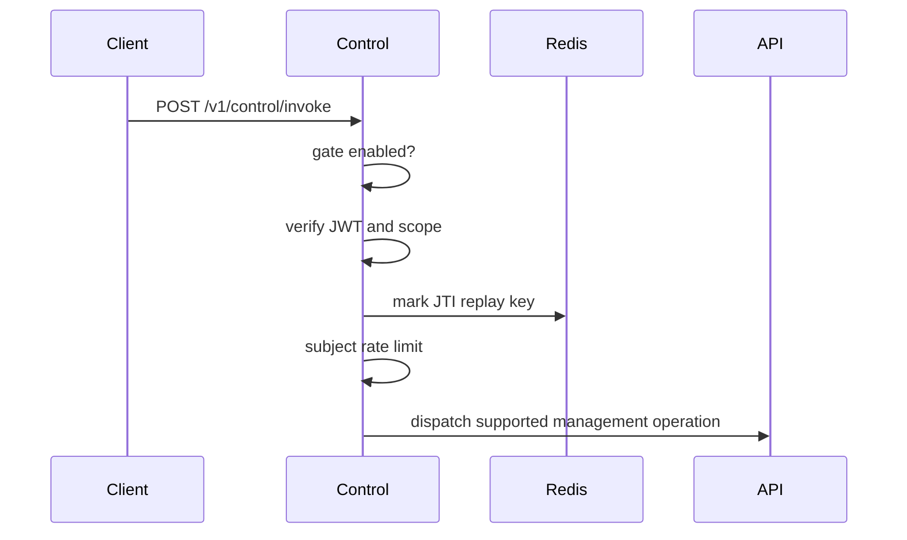

Control is an optional automation surface for remote management operations. It dispatches through the shared engine after gate, authentication, replay, rate-limit, and scope checks.

## Runtime

| Property | Value |
| --- | --- |
| Port | `8087` |
| Health | `GET /health` |
| Readiness | `GET /ready` |
| Invoke | `POST /v1/control/invoke` |
| Compose profile | `control` |
| Helm default | disabled |

## Invoke Flow



## Required Config

| Variable | Purpose |
| --- | --- |
| `STS_JWKS_URL` | JWT verification keys. |
| `STS_ISSUER_URL` | Expected issuer. |
| `CONTROL_AUDIENCE` | Expected token audience. |
| `CONTROL_REDIS_URL` | Replay protection and rate state in published modes. |
| `CONTROL_API_TOKEN` | API token used for downstream dispatch. |
| `CARACAL_API_URL` | API base URL. |
| `CONTROL_GATE_FILE` | File gate that must exist before invoke is available. |

## Non-Interactive Automation

Control is the automation counterpart to Console. A CI job, provisioning script,
or onboarding tool drives the same management operations a human performs in
Console, because both run through the shared engine dispatch. Automation never
receives the root admin token; it uses a scoped control key.

1. Create a control key once in Console from the Control menu. Console returns a
   one-time `client_id` and `client_secret` and records the `control:<command>:<verb>`
   scopes the key may request, along with an optional maximum token TTL. The key
   is bound to the zone where it was created.
2. Exchange the key for a short-lived token at the STS token endpoint.

   ```bash
   curl -s -X POST "$STS_URL/oauth/2/token" \
     -d grant_type=client_credentials \
     -d application_id="$CONTROL_CLIENT_ID" \
     -d client_secret="$CONTROL_CLIENT_SECRET" \
     -d resource=caracal-control \
     -d scope="control:resource:write control:policy:write"
   ```

3. Invoke a management command with the returned token.

   ```bash
   curl -s -X POST "$CONTROL_URL/v1/control/invoke" \
     -H "authorization: Bearer $TOKEN" \
     -H "content-type: application/json" \
     -d '{"command":"resource","subcommand":"create","flags":{"name":"PiperNet","identifier":"resource://pipernet","scopes":["pipernet.read"]}}'
   ```

STS resolves the bound zone from the authenticated control key; standard
bootstrap workflows must not ask users to provide a separate zone id. Supplying
`zone_id` on a Control key token exchange remains accepted for compatibility but
is deprecated. Each token is short-lived, replay-protected, rate-limited, and audited, so
least-privilege automation stays the easy path. The `controlBootstrap` example
ships a reusable client plus idempotent bootstrap and teardown scripts that
provision a demo provider, resource, and policy through this flow.

## Manage Control Keys

Control keys are created and managed in Console from the **Control** menu. A key is
a managed, zone-bound application whose only authority is the
`control:<command>:<verb>` scopes you grant it — never the root admin token.

When you create a key, Console opens a grouped permission picker:

- Each command is a group shown as `control:<command>:*` (for example
  `control:agent:*`). Toggling a group grants every action under that command.
- Reveal a group to expand its branch and grant a single action — `read`,
  `write`, or `delete` — instead of the whole command.
- Selections are checkboxes that persist while you move through the tree; the key
  is written with exactly the scopes you keep when you save.

A key can never exceed Console's own zone-bound management surface. The picker
offers only the commands Control exposes: local-only operations (the Control
lifecycle itself), non-zone operations, and hidden commands are never grantable.
A token later exchanged from the key is additionally checked against the scopes
recorded on the key, so a token can only narrow, never widen, the granted set.

## Safety Behavior

Control returns `503` when the gate is disabled, `401` for authentication or replay failures, `429` for rate limiting, `403` for denied dispatch, `400` for invalid requests, `501` for unsupported commands, and `502` for upstream errors.

Control is a product-management surface. Do not expose it as a top-level `caracal` runtime command.

## Related Pages

- [Choose the Right Surface](/runtime-console/cli-and-console/)
- [Enforce Boundaries](/architecture/trust-boundaries/)
- [Use Management API](/api/control-plane/)
- [Bootstrap Control State](/examples/control-bootstrap/)
