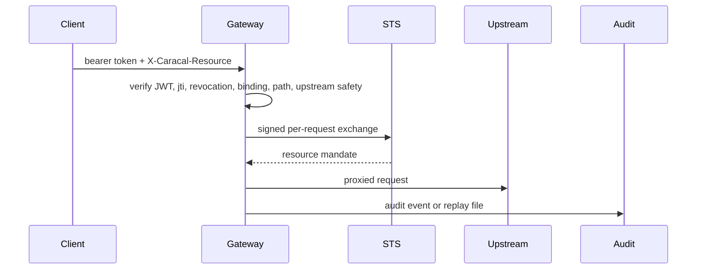

Gateway is the protected-resource ingress. It validates inbound Caracal authority, checks replay and revocation, exchanges with STS, and forwards to configured upstreams only after safety checks pass.

## Runtime

| Property | Value |
| --- | --- |
| Port | `8081` |
| Health/readiness | `/health`, `/ready` |
| Metrics | `/metrics`, `/metrics.json` |
| Revocation reload | `POST /internal/revocations/reload` |

## Request path

## Deny-before-upstream checks

- Missing, malformed, oversized, expiring, replayed, revoked, or signature-invalid bearer token.
- Missing `X-Caracal-Resource`.
- No binding for `(zone_id, resource)`.
- Client-supplied `X-Caracal-Client-ID`.
- Path traversal.
- STS exchange failure or open STS circuit.
- Unsafe upstream destination.

## Configuration highlights

| Variable | Purpose |
| --- | --- |
| `STS_URL` | STS endpoint for exchange and JWKS. |
| `GATEWAY_STS_HMAC_KEY` | Signs Gateway exchange requests. |
| `MAX_REQUEST_BYTES` | Request body limit, default 10 MiB. |
| `ALLOW_PRIVATE_UPSTREAMS` / `UPSTREAM_HOST_ALLOWLIST` | Controls private upstream routing. |
| `JTI_FAIL_OPEN` | Forbidden in published modes. |
| `AUDIT_REPLAY_DIR` | Replay directory for audit events. |

## Related pages

- [Gateway Behavior](/api/gateway/)
- [Trust Boundaries](/architecture/trust-boundaries/)
- [Harden Production](/operations/tls-hardening/)
