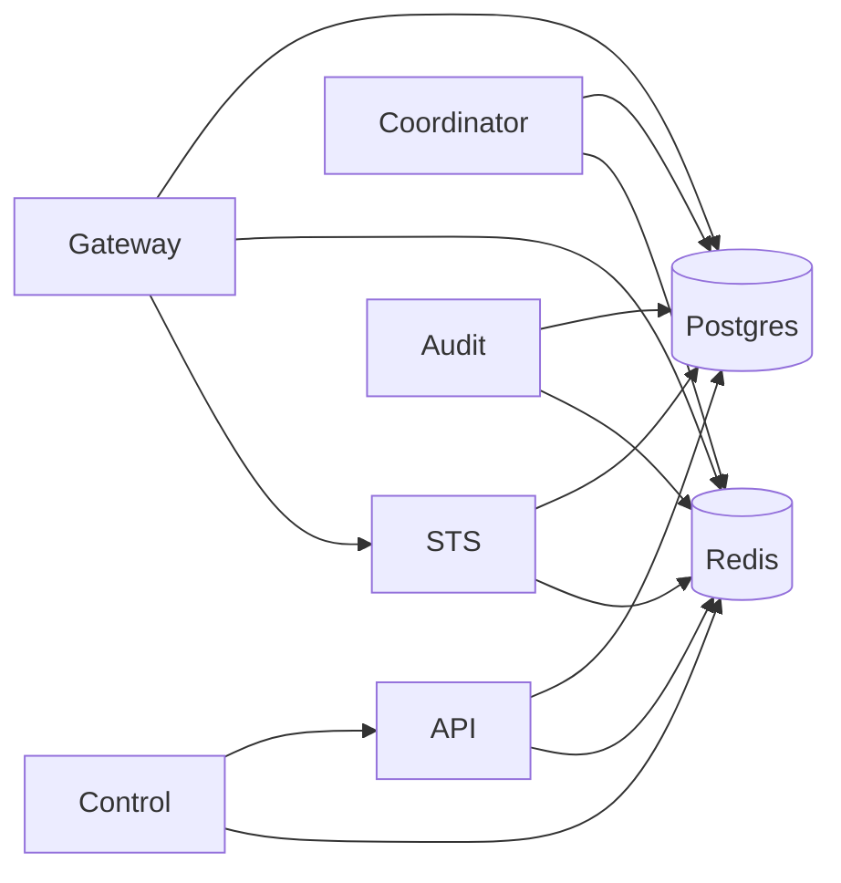

Caracal services are small, explicit runtime components. Each service owns a bounded part of the authority lifecycle and exposes health/readiness endpoints for operations.

## Service map

| Service | Port | Owns |
| --- | --- | --- |
| [Control-Plane API](/services/api/) | `3000` | Product state, management routes, policy/grant resources, admin audit, API outbox. |
| [Coordinator](/services/coordinator/) | `4000` | Agent sessions, service leases, delegation edges, invocations, Coordinator outbox. |
| [STS](/services/sts/) | `8080` | Token exchange, mandate issuance, JWKS, policy evaluation, step-up status. |
| [Gateway](/services/gateway/) | `8081` | Protected reverse proxy, per-request exchange, revocation checks, upstream safety. |
| [Audit](/services/audit/) | `9090` | Audit ingestion, DLQ, tamper checks, retention, search. |
| [Control](/services/control/) | `8087` | Optional remote management invocation through shared engine dispatch. |

## Dependency map

## Related sections

- [Understand Architecture](/architecture/)
- [Operations](/operations/)
- [API Reference](/api/)
