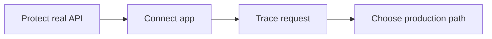

Tutorials are the guided path after [Get Started](/get-started/). They turn your first local success into the next developer tasks: protect a real API, call it from your app, trace one request, then choose the production integration guide that matches your stack.

## Tutorial Path

| Outcome | Tutorial | What you use |
| --- | --- | --- |
| Put an enforced boundary in front of one real HTTP service or provider route. | [Protect Your First Real API](./protect-an-api/) | Console **resource**, **provider**, **policy**, Gateway, and audit. |
| Wire application code through Caracal with the generated profile. | [Connect Your App with the SDK](./connect-an-agent/) | TypeScript, Python, or Go SDK; agent session; Gateway. |
| Prove why one protected request succeeded or failed. | [Trace One Protected Request](./inspect-a-run/) | Console **audit**, **request trace**, sessions, policy diagnostics, and delegation context. |
| Choose the durable guide for your production boundary. | [Choose Your Production Integration Path](./choose-production-path/) | Gateway, SDK, connector, runtime, delegation, audit, and step-up guides. |

## Before You Begin

You should have completed [First Protected Call](/get-started/first-protected-call/) or equivalent setup:

- a running Caracal stack;
- one zone;
- one confidential agent app;
- one protected resource;
- one active policy set;
- a generated runtime profile.

## After Tutorials

Use [Guides](/guides/) for task-specific implementation details, [SDKs](/sdks/) for package APIs, and [Concepts](/concepts/) when you need the reference model behind policy, delegation, revocation, or audit.
